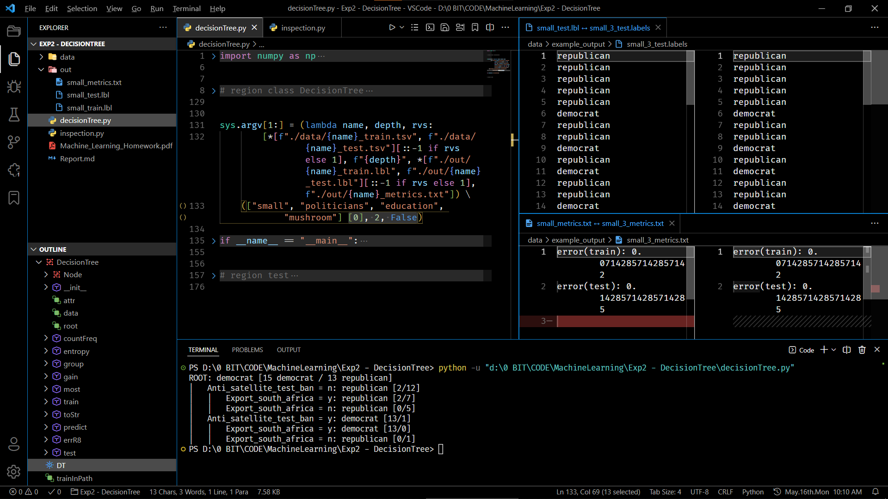

# 实验：决策树

**姓名：刘亮儒  ｜  学号：1120192858  ｜  班号：07111906**

## 1 实验目的和内容

&emsp;&emsp;实验目的：从零开始开始实现一个决策树分类器，并将其应用于分类问题，对具体问题依次进行学习、预测、评估。

&emsp;&emsp;实验内容：首先编写一个简单的程序，计算拆分前标签的熵和使用多数票分类的错误率，这无需查看任何属性的值就可算出。然后实验重点内容是实现一个决策树分类器，其应能学习指定最大深度的决策树、以指定格式打印决策树、预测训练集和测试集的标签并计算误差。代码完成后，在四份数据集上各运行一遍，其中一份给出了参考答案，可对照来判断自己的程序是否正确。两个程序根据传入的命令行参数运行；编程语言可选 Python、Java、C++。

## 2 实验原理

&emsp;&emsp;决策树是一种机器学习方法，它是一种树形结构，节点代表对属性的判断，分支代表判断结果，最后叶节点代表分类结果。举个例子：判断是不是好学生，可以先看他的分数是否够高，若是则为好学生，否则再看该学生的出勤率等等，这就是一系列决策过程。但是为什么要把分数当作第一个判断的节点呢？这就涉及了决策树的构造方法。

&emsp;&emsp;决策树的构造过程，就是不断选择条件来划分数据集；熵，即混乱度，可以用来衡量划分效果的优劣。一组数据的熵使用公式 $Ent\left(D\right)=-\sum_{i=1}^n{p_i\log_2p_i}$ 来计算，进行一次划分后分成了 $m$ 小组数据，各部分的熵均可用之前的公式来计算，之后再用 $Ent\left(D,a\right)=\sum_{j=1}^m{\frac{\left|D_j\right|}{\left|D\right|}Ent\left(D_j\right)}$ 加权求和合起来得到划分后数据的熵。新熵比原熵降低了，就说明通过划分使数据变得规整了，我们获得了更多的信息，这叫做信息增益，即 $Gain\left(D,a\right)=Ent\left(D\right)-Ent\left(D,a\right)$。对一组数据尝试多种划分条件，采用熵减最大的，因为熵减越大的划分效果越好。

&emsp;&emsp;上述基于信息增益的决策树构建算法叫作 `ID3`。比较常用的还有 `C4.5` 和 `CART`，它们是对 `ID3` 的优化。但由于本实验未涉及到，便不再展开，具体可参考链接 [【决策树讲解】](https://zhuanlan.zhihu.com/p/197476119)。

## 3 具体过程和步骤

&emsp;&emsp;题目为了简单起见，对于提供的所有数据集，其所有属性都被离散化为两个类别。但我在完成代码时，并没有局限于二分类，而是设计成较为通用的多分类。

&emsp;&emsp;下图展示了程序关键部分的结构：

<pre style="font-family:Fira Code; font-size:80%; margin: 0 20%;">
class DecisionTree
 ├─ class Node
 │   └─ func init
 ├─ func init
 ├─ func countFreq [tool]
 ├─ func entropy [tool]
 ├─ func group [tool]
 ├─ func gain [tool]
 ├─ func most [tool]
 ├─ func train
 │   ├─ func split
 │   └─ func _train
 ├─ func toStr
 │   └─ func_toStr
 ├─ func predict
 ├─ func errR8 [tool]
 └─ func test
</pre>

里面有很多静态函数作为工具函数，它们和树本身没有很强的联系，其中 `entropy` 和 `gain` 两个函数就对应着上文所述公式。

&emsp;&emsp;这个 `DecisionTree` 类的运行流程可以通过主函数看出：<font color="gray">（伪代码）</font>

``` Python
_, trainInPath, ..., *_ = sys.argv
trainTbl = np.loadtxt (trainInPath)
dTree = DecisionTree (trainAttr, trainData) .train (maxDepth)
print (dTree.toStr ())
testPred, testErrR8 = dTree.test (testData)
print (testPred, testErrR8)
```

在获取命令行参数、加载数据集文件后，首先调用构造函数 `init` 来初始化一棵决策树，然后执行 `train` 函数开始训练。训练是一个递归过程，其间会不断调用 `split` 试图分割节点。训练完成后即可用 `toStr` 展示，用 `test` 预测和检验。

## 4 运行效果展示

&emsp;&emsp;程序当然可以根据传入的命令行参数运行，但是在主函数代码的开头，我已经针对提供的数据集按格式写好了参数，可以很方便地切换数据集，取消注释即可直接运行。

&emsp;&emsp;以下是运行效果截图：



运行结果与参考答案一致，实验成功。

&emsp;&emsp;实验分析：1. 程序运行速度比较快，最大的数据集的运行时间在 2s 以内。2. 分类效果比较好，对于比较合理的参数，错误率普遍在 10% 以内，其中测试集都比训练集高一些。3. 虽然本程序设计的是能做多分类，但由于未经仔细测试，这里就不展示了。

<br>

-----
<center><small> 机器学习
